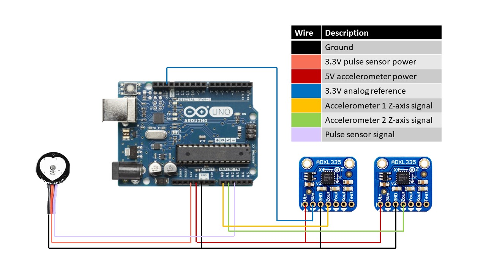

## BIOE 421 Final Project: Real-time display tool for venous pulsation data
A device for real-time visualization and processing of accelerometer and pulse sensor data for Team Jugularnauts, a Rice University senior engineering design team.

##### Possible features:
- Live display of raw accelerometer data
- Live display of pulse sensor data
- Studfinder function for locating strongest pulsation signal
- Signal subtraction of competitor physiological signals (i.e., carotid vs. jugular pulsations)
- Signal processing to isolate jugular vein pulsation

### Abstract
This device will serve as a realtime information display for use in developing a device to measure jugular venous pressure, as part of Team Jugularnauts' senior design project. Preliminary prototypes will feature raw data acquisition from a 2x1 accelerometer array and an optical pulse sensor. The accelerometers and pulse sensor will be interfaced with Arduino through analog input pins. Arduino will be used for its precise timing capabilities, which are important for accurate signal subtraction, and will be connected to Raspberry Pi to provide realtime visual display of raw data through a Processing GUI. Future implementations may incorporate other desired features, including signal localization and signal processing. Signal localization may be explored through a “stud finder” mechanism, through which the strength of the signal corresponds to visual feedback on the Processing GUI, allowing the user to place the device correctly over the location of strongest signal (i.e., over the carotid/jugular bundle). Signal processing may be explored for reducing noise and subtracting competing physiologic signals, in order to isolate pulsations of the jugular vein.

### Milestones, Goals, and Due Dates
11/3: Project abstract due
- Publish final abstract to Github
- Prototype Processing GUI visualization using data from single ADXL335 accelerometer

11/9: Initial prototype due
- Prototype visualization with 2x1 accelerometer array
- Implement pulse sensor acquisition and visualization (if parts arrive)
- 3D print casing for device to be used on human neck, rather than affixed to breadboard

11/16: Fit and finish due
- Finalize GUI for visualization of raw signals
- Assemble 3D printed casing and hardware components
- Explore signal localization and subtraction of carotid pulse (heart beat)

11/28: Final code due
- Finalize additional features (signal localization and subtraction)

### Hardware
Our final prototype uses 2 [Adafruit ADXL335 accelerometer](https://www.adafruit.com/product/163) breakout boards, an [Arduino-compatible Pulse Sensor](https://www.adafruit.com/product/1093), and an [Arduino Uno](https://store.arduino.cc/usa/arduino-uno-rev3). We 3D-printed a case to house the accelerometers that also serves to suspend them for free, mechanically isolated movement. This is a critical part of our design since we were trying to measure very small deflections from the jugular vein.

##### Basic Implementation
The ADXL335 breakout boards are designed to receive 5V power, which is regulated onboard to 3.3V. This means that the output signal will be some voltage between 0 and 3.3V. The Pulse Sensor can operate on a 3.3V or 5V supply, giving it a little more flexibility.

However, since the internal voltage reference on Arduino is only 1.1V, the analog reference pin should be used by feeding it a 3.3V supply from one of the ADXL accelerometers. This essentially tells the Arduino's analog to digital converter (ADC) what voltage range to expect from the input signals. Since the Pulse Sensor is referenced to this same voltage, it is essential to power it with 3.3V, even though the accelerometers are powered with 5V. This ensures that all output signals are on the same 0 -- 3.3V range. The wiring diagram for this configuration is presented below.

##### Improving Signal Quality: Filtering and Amplification
One major challenge we faced with this hardware was insufficient resolution. Since the accelerometer breakout boards are fixed at a -3g -- 3g acceleration range, the tiny forces produced by the jugular vein yield very small voltage changes from the accelerometers. This, paired with the 10-bit resolution for the Uno's analog input, yields a small signal that approaches the discretization limit of the ADC.

To help solve this problem, we implemented a low-pass filter at 5 Hz to reduce noise and amplified the signal with a gain of 2.2 to bring the signal closer to the 5V maximum range for the ADC.

This also required changes to the previous configuration. Since the new expected voltage range is 5V, the analog reference pin must also be fed 5V. Thus, the Pulse Sensor should also be powered and referenced to 5V. The wiring diagram for this configuration is presented below (coming soon).

### Software
We used our Arduino Uno to acquire raw analog signals from the accelerometers and pulse sensor, then sent this data to a Processing interface for real-time visualization of the signals.

##### Arduino
The Arduino sketch reads the raw voltages from each of the 3 sensors and performs sample averaging (n=50) to help smooth the data. The data points for each sensor are stored in a string which is sent to Processing via a serial connection.

To change the number of points used in sample averaging, simply change the value of this line in the VenousPulseFirmware.ino sketch:

			// Take multiple samples to reduce noise
			   const int sampleSize = 50;

##### Processing
Processing receives the strings of data from the Arduino Uno and parses them into individual data points. The data for each accleromter and the pulse sensor are then plotted on a single graph. This graph features a legend with the raw readings from each accelerometer and an adjustable y-axis scale. The boxes at the top and bottom of the scale allow for user input to adjust the range of data being displayed.

### Acknowledgements
Thanks to Dr. Jordan Miller and Madeleine Gomel for their advice and support throughout this semester.

Thanks to [Arduino](https://www.arduino.cc), [Processing](https://www.processing.org), [Adafruit](https://www.adafruit.com), and [World Famous Electronics](https://pulsesensor.com/) for developing the hardware and software we needed to create our device.